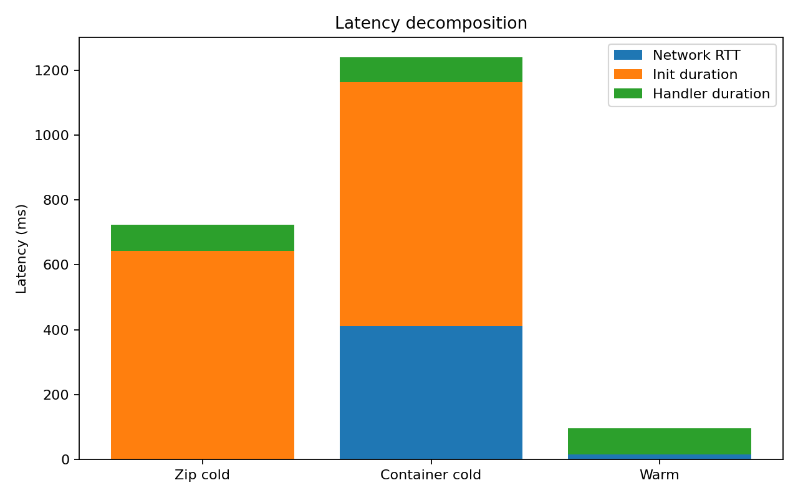
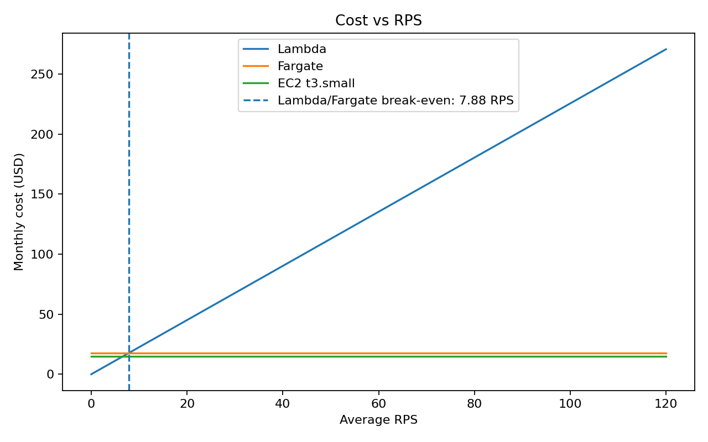

# AWS Cloud Lab Report

**Author:** Diana Hunchak
**Course:** LSC
**Region:** us-east-1

---

## 1. Introduction

The goal of this lab was to compare AWS Lambda, ECS Fargate, and EC2 using the same workload: a brute-force k-nearest-neighbor search over 50,000 vectors of dimension 128.

The comparison focused on:

* cold start latency,
* warm steady-state latency,
* burst behavior after idle time,
* cost at zero load,
* monthly cost under a realistic traffic model,
* ability to satisfy the p99 < 500 ms SLO.

The tested environments were:

| Target | Environment | Deployment                     |
| ------ | ----------- | ------------------------------ |
| A1     | AWS Lambda  | Zip package                    |
| A2     | AWS Lambda  | Container image                |
| B      | ECS Fargate | One task behind ALB            |
| C      | EC2         | t3.small with Docker container |

All resources were deployed in the `us-east-1` region. Load tests were executed from an EC2-based workstation in the same region.

---

## 2. Assignment 1 — Endpoint Verification

All four endpoints were deployed and tested with the same fixed query vector.

Raw output file:

```text
results/assignment-1-endpoints.txt
```

| Environment      | Verification result |
| ---------------- | ------------------- |
| Lambda zip       | Successful          |
| Lambda container | Successful          |
| Fargate          | Successful          |
| EC2              | Successful          |

The returned `results` arrays were identical across all environments:

```text
35859, 24682, 35397, 20160, 30454
```

This confirms that all deployments used the same workload, dataset, and query vector.

Example measured `query_time_ms` values during endpoint verification:

| Environment      | query_time_ms |
| ---------------- | ------------: |
| Lambda zip       |     70.234 ms |
| Lambda container |     66.380 ms |
| Fargate          |     50.608 ms |
| EC2              |     23.780 ms |

---

## 3. Assignment 2 — Scenario A: Cold Start Characterization

### 3.1 Methodology

Lambda cold starts were measured for both Lambda deployment variants:

* Lambda zip package,
* Lambda container image.

Before the test, Lambda functions were left idle. Then 30 sequential requests were sent to each Lambda endpoint.

Raw output files:

```text
results/scenario-a-zip.txt
results/scenario-a-container.txt
results/cloudwatch-zip-reports.txt
results/cloudwatch-container-reports.txt
```

Cold starts were identified using CloudWatch `REPORT` lines containing `Init Duration`.

### 3.2 Scenario A Client-Side Results

| Metric             | Lambda zip | Lambda container |
| ------------------ | ---------: | ---------------: |
| p50 client latency |   96.75 ms |         98.90 ms |
| p95 client latency |  121.13 ms |        154.30 ms |
| p99 client latency |  178.51 ms |       1239.40 ms |
| Max client latency |  178.51 ms |       1239.40 ms |

Both Scenario A files returned only successful responses.

| File                       | Status code distribution |
| -------------------------- | ------------------------ |
| `scenario-a-zip.txt`       | `[200] 30 responses`     |
| `scenario-a-container.txt` | `[200] 30 responses`     |

### 3.3 CloudWatch Cold Start Data

CloudWatch `REPORT` lines were exported after the Lambda scenarios. The exported logs contained both handler duration and cold-start init duration values.

| Variant          | REPORT count | Cold start count | Avg handler duration | Avg init duration |
| ---------------- | -----------: | ---------------: | -------------------: | ----------------: |
| Lambda zip       |         1291 |               26 |             80.38 ms |         642.83 ms |
| Lambda container |         1291 |               28 |             77.12 ms |         751.95 ms |

The container deployment had a higher average init duration than the zip deployment:

```text
Lambda zip avg init duration:       642.83 ms
Lambda container avg init duration: 751.95 ms
```

This means the zip deployment had faster cold starts in this experiment.

### 3.4 Latency Decomposition

The latency decomposition chart was saved as:

```text
results/figures/latency-decomposition.png
```



Network RTT was estimated as:

```text
Warm: Network RTT = client latency - handler duration
Cold: Network RTT = client latency - init duration - handler duration
```

Because the CloudWatch export was collected over a broader measurement window, the decomposition chart should be treated as an approximation rather than an exact one-to-one mapping between a specific client request and a specific CloudWatch `REPORT` line.

### 3.5 Analysis

The cold start latency was higher than warm invocation latency because Lambda had to initialize a new execution environment before executing the handler.

In this experiment, the Lambda zip deployment had lower average init duration than the Lambda container deployment. This is expected because a zip deployment usually has less image loading overhead than a container image. However, the exact difference depends on package size, image size, caching, and AWS internal optimizations.

---

## 4. Assignment 3 — Scenario B: Warm Steady-State Throughput

### 4.1 Methodology

All endpoints were warmed up before the tests. Then 500 requests were sent at different concurrency levels.

Lambda was tested at concurrency 5 and 10.
Fargate and EC2 were tested at concurrency 10 and 50.

Raw output files:

```text
results/scenario-b-*.txt
```

All Scenario B files returned successful responses after SigV4 signing was correctly configured for Lambda Function URLs.

### 4.2 Results

| Environment      | Concurrency | p50 (ms) | p95 (ms) | p99 (ms) | Server avg query_time_ms / handler avg (ms) | Tail instability |
| ---------------- | ----------: | -------: | -------: | -------: | ------------------------------------------: | ---------------- |
| Lambda zip       |           5 |    91.51 |   111.85 |   147.36 |                                       80.38 | no               |
| Lambda zip       |          10 |    86.46 |   105.84 |   140.05 |                                       80.38 | no               |
| Lambda container |           5 |    84.06 |   103.23 |   134.78 |                                       77.12 | no               |
| Lambda container |          10 |    83.09 |   102.26 |   136.92 |                                       77.12 | no               |
| Fargate          |          10 |  1091.00 |  1490.80 |  1711.60 |                                       50.61 | no               |
| Fargate          |          50 |  5399.90 |  5898.40 |  6094.20 |                                       50.61 | no               |
| EC2              |          10 |   221.18 |   292.85 |   329.43 |                                       23.78 | no               |
| EC2              |          50 |  1004.00 |  1249.60 |  1332.70 |                                       23.78 | no               |

A result was marked as tail-unstable if:

```text
p99 > 2 × p95
```

None of the Scenario B results satisfied this condition.

### 4.3 Analysis

Lambda showed the best warm steady-state latency. Its p50 latency changed only slightly between concurrency 5 and concurrency 10:

```text
Lambda zip p50:       91.51 ms → 86.46 ms
Lambda container p50: 84.06 ms → 83.09 ms
```

This happened because concurrent Lambda requests can be handled by separate Lambda execution environments. Therefore, requests do not queue inside one long-running server process in the same way as they do on a single Fargate task or a single EC2 instance.

Fargate and EC2 showed much higher latency at high concurrency. This is especially visible for Fargate:

```text
Fargate c10 p50: 1091.00 ms
Fargate c50 p50: 5399.90 ms
```

This indicates strong queueing on the single deployed Fargate task. EC2 also showed queueing at concurrency 50:

```text
EC2 c10 p50: 221.18 ms
EC2 c50 p50: 1004.00 ms
```

The difference between server-side `query_time_ms` and client-side latency is caused by network latency, HTTP overhead, Lambda Function URL overhead, ALB overhead for Fargate, request serialization/deserialization, and client-side measurement overhead. For Fargate and EC2, the difference is especially large at high concurrency because requests queue before the application can process them.

---

## 5. Assignment 4 — Scenario C: Burst from Zero

### 5.1 Methodology

Lambda functions were left idle before the burst test. Then a burst test was executed:

* Lambda: 200 requests at concurrency 10,
* Fargate: 200 requests at concurrency 50,
* EC2: 200 requests at concurrency 50.

Raw output files:

```text
results/scenario-c-*.txt
```

All Scenario C files returned successful responses.

### 5.2 Results

| Environment      | Concurrency | p50 (ms) | p95 (ms) | p99 (ms) | Max latency (ms) | Cold starts |
| ---------------- | ----------: | -------: | -------: | -------: | ---------------: | ----------: |
| Lambda zip       |          10 |    97.70 |  1301.80 |  1462.80 |          1559.50 |          26 |
| Lambda container |          10 |    93.30 |  1052.00 |  1245.40 |          1282.70 |          28 |
| Fargate          |          50 |  5115.30 |  5779.80 |  6129.50 |          6209.20 |         N/A |
| EC2              |          50 |   937.70 |  1144.40 |  1210.40 |          1229.90 |         N/A |

### 5.3 Analysis

Lambda showed a clear burst-from-zero effect. The median latency remained low:

```text
Lambda zip p50:       97.70 ms
Lambda container p50: 93.30 ms
```

However, p95 and p99 were much higher:

```text
Lambda zip p99:       1462.80 ms
Lambda container p99: 1245.40 ms
```

This indicates a bimodal distribution:

* most requests were served by warm execution environments and formed a low-latency cluster,
* cold-start requests formed a high-latency cluster.

CloudWatch logs confirmed cold starts:

```text
Lambda zip cold starts:       26
Lambda container cold starts: 28
```

The required SLO was:

```text
p99 < 500 ms
```

As deployed, Lambda did not meet the SLO under burst-from-zero traffic:

```text
Lambda zip p99:       1462.80 ms
Lambda container p99: 1245.40 ms
```

Fargate and EC2 also did not meet the SLO under the tested burst configuration:

```text
Fargate p99: 6129.50 ms
EC2 p99:     1210.40 ms
```

For Fargate and EC2, the issue was not cold start but queueing on a single task or single instance.

---

## 6. Assignment 5 — Cost at Zero Load

Pricing was checked for the `us-east-1` region and documented with screenshots in:

```text
results/figures/pricing-screenshots/
```

The screenshots contain the following values:

| Environment | Pricing component |                          Value |
| ----------- | ----------------- | -----------------------------: |
| Lambda      | Requests          |       0.20 USD per 1M requests |
| Lambda      | Compute           | 0.0000166667 USD per GB-second |
| Fargate     | vCPU              |      0.04048 USD per vCPU-hour |
| Fargate     | Memory            |       0.004445 USD per GB-hour |
| EC2         | t3.small          |            0.0208 USD per hour |

### 6.1 Idle Cost

The idle period was assumed to be 18 hours per day.

| Environment  | Hourly idle cost | Monthly idle cost for 18h/day |
| ------------ | ---------------: | ----------------------------: |
| Lambda       |       0.0000 USD |                    0.0000 USD |
| Fargate      |     0.024685 USD |                   13.3299 USD |
| EC2 t3.small |     0.020800 USD |                   11.2320 USD |

Lambda has zero idle cost because it is billed only when requests are executed. Fargate and EC2 generate idle cost because their resources remain allocated even when no requests are processed.

---

## 7. Assignment 6 — Cost Model and Break-Even

### 7.1 Traffic Model

The traffic model was:

| Period |    Load |   Duration |
| ------ | ------: | ---------: |
| Peak   | 100 RPS | 30 min/day |
| Normal |   5 RPS |  5.5 h/day |
| Idle   |   0 RPS |   18 h/day |

Requests per day:

```text
Peak = 100 × 30 × 60 = 180,000
Normal = 5 × 5.5 × 3600 = 99,000
Total/day = 279,000
Total/month = 279,000 × 30 = 8,370,000
```

### 7.2 Lambda Monthly Cost

Lambda formula:

```text
Monthly cost =
(requests/month × 0.20 / 1,000,000)
+
(requests/month × duration_seconds × memory_GB × 0.0000166667)
```

Assumptions:

```text
Requests/month = 8,370,000
Memory = 512 MB = 0.5 GB
Measured Lambda duration = 0.0804 s
```

Calculation:

```text
Request cost = 8,370,000 × 0.20 / 1,000,000 = 1.6740 USD

Compute cost = 8,370,000 × 0.0804 × 0.5 × 0.0000166667 = 5.6064 USD

Lambda monthly cost = 1.6740 + 5.6064 = 7.2804 USD
```

### 7.3 Fargate and EC2 Monthly Cost

Always-on cost formula:

```text
Monthly cost = hourly_rate × 24 × 30
```

Fargate hourly cost for one 0.5 vCPU / 1 GB task:

```text
Fargate hourly cost =
0.5 × 0.04048 + 1 × 0.004445
= 0.024685 USD/hour
```

Monthly costs:

| Environment  |  Hourly rate | Monthly cost |
| ------------ | -----------: | -----------: |
| Fargate      | 0.024685 USD |  17.7732 USD |
| EC2 t3.small | 0.020800 USD |  14.9760 USD |

### 7.4 Break-Even RPS

Let:

```text
r = average RPS
S = seconds per month = 2,592,000
d = measured Lambda duration in seconds = 0.0804
m = Lambda memory in GB = 0.5
F = Fargate monthly cost = 17.7732
```

Lambda cost as a function of average RPS:

```text
LambdaCost(r) =
r × S × (0.20 / 1,000,000)
+
r × S × d × m × 0.0000166667
```

Break-even:

```text
LambdaCost(r) = F
```

Therefore:

```text
r =
F /
[S × (0.20 / 1,000,000 + d × m × 0.0000166667)]
```

Substitution:

```text
r =
17.7732 /
[2,592,000 × (0.20 / 1,000,000 + 0.0804 × 0.5 × 0.0000166667)]
```

Result:

```text
Break-even RPS = 7.88
```

At an average load below approximately 7.88 RPS, Lambda is cheaper than Fargate. Above this point, Fargate can become more cost-effective, assuming the same always-on configuration.

### 7.5 Cost vs RPS Chart

The cost chart was saved as:

```text
results/figures/cost-vs-rps.png
```



---

## 8. Final Recommendation

Based on the measurements, I recommend **AWS Lambda**, but **not in the default configuration**.

Lambda had the best warm steady-state latency and the lowest monthly cost. In Scenario B, Lambda zip achieved:

```text
p99 = 147.36 ms at concurrency 5
p99 = 140.05 ms at concurrency 10
```

Lambda container achieved:

```text
p99 = 134.78 ms at concurrency 5
p99 = 136.92 ms at concurrency 10
```

These values are well below the required p99 < 500 ms SLO.

However, under burst-from-zero traffic in Scenario C, Lambda did not meet the SLO:

```text
Lambda zip p99:       1462.80 ms
Lambda container p99: 1245.40 ms
```

This was caused by cold starts. CloudWatch logs contained:

```text
Lambda zip cold starts:       26
Lambda container cold starts: 28
```

Therefore, Lambda would need additional configuration to meet the SLO under sudden bursts. The most important change would be enabling provisioned concurrency for the expected burst level. Other useful changes would include reducing initialization work, reducing package or image size, and optimizing dependency loading.

Fargate and EC2 were always warm, but the deployed configuration also did not meet the SLO under burst load:

```text
Fargate p99: 6129.50 ms
EC2 p99:     1210.40 ms
```

For Fargate and EC2, the problem was queueing on a single task or instance. To meet the SLO, Fargate would need multiple tasks and auto-scaling, while EC2 would need a larger instance or multiple instances behind a load balancer.

From the cost perspective, Lambda was the cheapest option for the given traffic model:

| Environment  | Monthly cost |
| ------------ | -----------: |
| Lambda       |   7.2804 USD |
| Fargate      |  17.7732 USD |
| EC2 t3.small |  14.9760 USD |

The Lambda/Fargate break-even point was approximately:

```text
7.88 average RPS
```

The recommendation would change under the following conditions:

* if average load exceeded approximately 7.88 RPS, Fargate could become more cost-effective;
* if cold starts were unacceptable and provisioned concurrency was not allowed, a scaled always-warm environment would be preferable;
* if the SLO were relaxed above 500 ms, default Lambda would become more attractive for unpredictable traffic;
* if Fargate were allowed to scale to multiple tasks, it could become a better latency option for sustained high concurrency;
* if EC2 were deployed as multiple instances behind a load balancer, it could also become a stronger option for predictable high traffic.

In conclusion, for unpredictable and spiky traffic with low average utilization, Lambda is the best economic choice. However, to satisfy the strict p99 < 500 ms SLO during bursts, Lambda must be configured with provisioned concurrency or another cold-start mitigation strategy.

---

## 9. Cleanup

After completing the lab and copying all result files locally, AWS resources should be removed using:

```bash
bash deploy/99-cleanup.sh
```

Cleanup is necessary because EC2 and Fargate resources continue generating cost while running.
